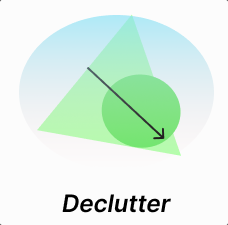

# declutter

<p align="center">
 
</p>

Declutter is a tool to organize your files in correct folder structure.
Remove all the clutter from your specified directory from your terminal!

Declutter looks into all the files(excluding hidden files) provided in a given directory. Then based on extension type moves those files into relevant folders.

## Usage:

```
Usage: declutter [options...] -p <filepath>

Options: 
        --verbose Show verbose logs.
        --path path to the directory where you would like to run this. By Default, will prompt you to confirm current directory location.
        --show Show the result of running this action without moving files.
```
